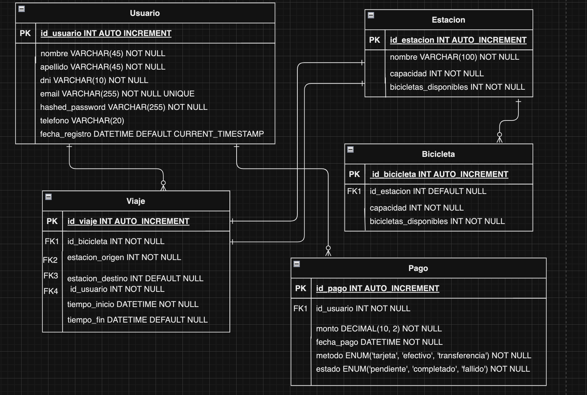

# Bike Sharing Database System

## Overview

Bike Sharing Database System is a relational database project developed for a university coursework assignment using SQL and MariaDB/MySQL.

The system manages the operation of a bicycle sharing service, including users, bicycles, stations, trips, and payments. The project focuses on database modeling, business rule enforcement, transaction management, and data integrity.

---

## Features

### User Management

* User registration and profile storage.
* Unique validation for DNI and email addresses.
* Registration timestamp tracking.

### Station Management

* Station capacity control.
* Automatic tracking of available bicycles.
* Validation to prevent exceeding station capacity.

### Bicycle Management

* Bicycle status management:

  * Available
  * In repair
  * In trip
* Station assignment control.
* Integrity checks between bicycle status and station location.

### Trip Management

* Trip registration.
* Origin and destination station tracking.
* Start and end time recording.
* Validation of bicycle availability before starting a trip.

### Payment Management

* Payment registration.
* Multiple payment methods.
* Payment status tracking.

---

## Database Design

The database is composed of the following entities:

* Usuario
* Bicicleta
* Estacion
* Viaje
* Pago

### Entity Relationship Diagram

---

## Advanced SQL Features

### Triggers

#### actualizar_bicicletas_disponibles_insert

Automatically updates the number of available bicycles when a new bicycle is added.

#### actualizar_bicicletas_disponibles_delete

Automatically updates station availability when a bicycle is removed.

#### validar_bicicleta_en_viaje

Validates that:

* The bicycle is available.
* The bicycle belongs to the selected origin station.

---

### Stored Procedures

#### registrar_viaje()

Handles trip creation by:

* Validating bicycle availability.
* Starting a transaction.
* Updating bicycle status.
* Registering the trip.
* Committing the transaction.

#### registrar_retorno()

Handles bicycle return by:

* Validating available space in the destination station.
* Updating trip information.
* Updating bicycle location and status.
* Managing transactions and rollback on errors.

---

### Views

#### estaciones_mas_utilizadas

Displays the three stations with the highest number of trips.

#### bicicletas_mas_utilizadas

Displays the bicycles most frequently used during the last 30 days.

#### viajes_largos

Displays trips longer than 30 minutes.

---

## Example Queries

The project includes analytical SQL queries such as:

* Users with more than 10 trips originating from a single station during the current month.
* Bicycles that have visited every station.
* Trips involving newly used bicycles and highly active users.

---

## Technologies

* SQL
* MariaDB
* MySQL
* Relational Database Design
* Entity Relationship Modeling

---

## Learning Outcomes

This project demonstrates:

* Relational database modeling.
* Primary and foreign key implementation.
* Data integrity enforcement.
* Trigger development.
* Stored procedure creation.
* Transaction management.
* View creation.
* Complex SQL query development.

